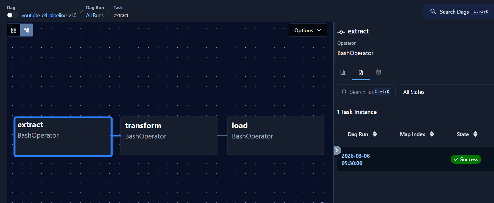
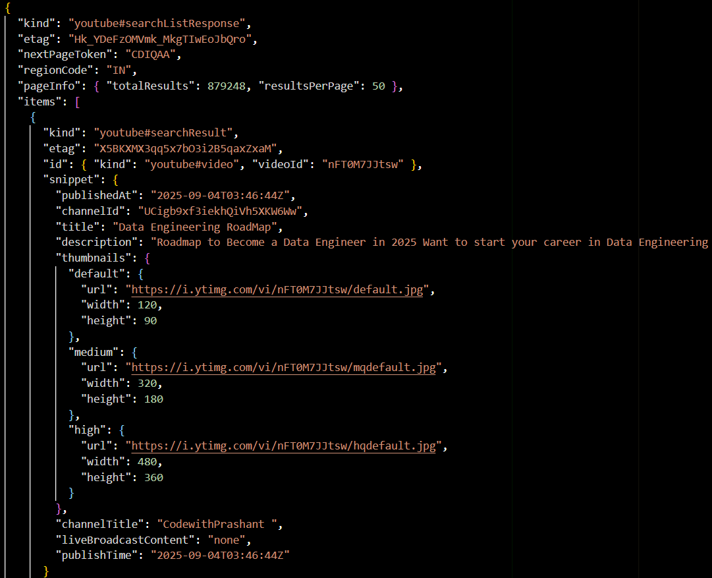
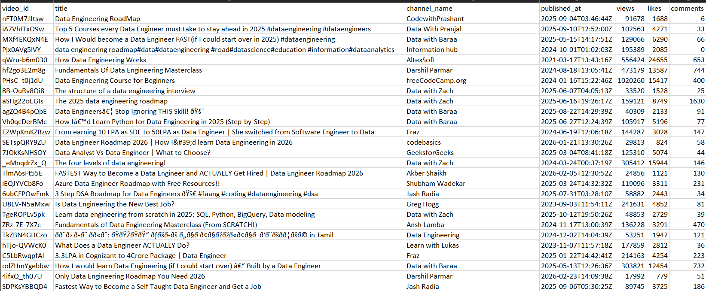
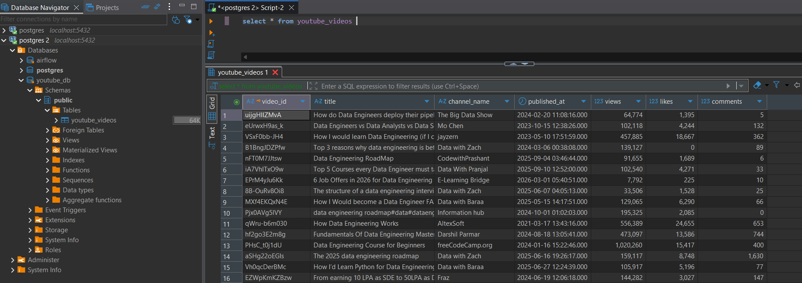

# YouTube ETL Pipeline Project


An end-to-end **Data Engineering pipeline** that extracts video data from the **YouTube Data API**, transforms it using **Python & Pandas**, and loads the structured data into **PostgreSQL**.

The workflow is orchestrated using **Apache Airflow (running in Docker)** and the final data can be explored using **DBeaver**.

---

# Project Architecture

    YouTube API
        │
        ▼
    Extract Script (Python)
        │
        ▼
    Raw JSON Storage
        │
        ▼
    Transform Script (Pandas)
        │
        ▼
    Processed CSV
        │
        ▼
    Load Script
        │
        ▼
    PostgreSQL Database
        │
        ▼
    Query using DBeaver


---

# Tech Stack

| Technology        | Purpose                    |
|-------------------|----------------------------|
| Python            | ETL scripting              |
| Apache Airflow    | Workflow orchestration     |
| YouTube Data API  | Data source                |
| PostgreSQL        | Data warehouse             |
| Pandas            | Data transformation        |
| Docker            | Containerized environment  |
| DBeaver           | Database visualization     |

---

# Project Structure
    youtube-data-engineering-pipeline
    │
    ├── dags
    ├── scripts
    ├── data
    │   ├── raw
    │   └── processed
    ├── images
    ├── docker-compose.yml
    ├── requirements.txt
    └── README.md


---

# ETL Pipeline Steps

## 1 Extract

The pipeline fetches video metadata from the **YouTube Data API**.

The raw API response is stored as **JSON files** inside:

**data/raw/**
(Note:- This is used to test the working of the code. Do not be confused with directories.)


Example fields extracted:

- video_id
- title
- channel
- published_at

---

## 2 Transform

The raw JSON file is processed using **Python and Pandas**.

The transformation step:

- Reads the latest JSON file
- Extracts required fields
- Converts the data into tabular format
- Saves the cleaned dataset as CSV

Output file:

**data/processed/youtube_clean.csv**
(Note:- This is used to test the working of the code. Do not be confused with directories.)


---

## 3 Load

The cleaned CSV dataset is loaded into a **PostgreSQL table**.

Table schema:

| Column Name   | Description                          |
|---------------|--------------------------------------|
| video_id      | Unique YouTube video ID (Primary Key)|
| title         | Title of the video                   |
| channel       | Channel name                         |
| published_at  | Video publish timestamp              |

Example record:

| video_id    |                 title                        |     published_at    |
|-------------|----------------------------------------------|---------------------|
| hf2go3E2m8g | Fundamentals Of Data Engineering Masterclass | 2024-08-18 13:05:41 |

**Note:**  
`video_id` is defined as the **PRIMARY KEY** to prevent duplicate entries.

---

# Workflow Automation with Airflow

The ETL workflow is orchestrated using **Apache Airflow DAGs**.

Pipeline tasks:

    extract_data
        ↓
    transform_data
        ↓
    load_data


Each step runs sequentially and ensures reliable execution of the pipeline.

---

# Running the Project

## 1 Start Airflow using Docker

```bash 

docker compose up -d

```

---

## 2 Open Airflow UI

Open in your browser:

```bash

http://localhost:8080

```

**Default credentials:**

```bash
username: airflow
password: airflow
```

---

## 3 Trigger the DAG

Enable and trigger the DAG from the Airflow dashboard.

The pipeline will automatically:

1. Extract data from the YouTube API  
2. Transform JSON → structured dataset  
3. Load data into PostgreSQL  

---

# Screenshots

## Airflow DAG Execution

Paste screenshot here



---

## Raw JSON Data Extracted

Paste screenshot here



---

## Transformed Data (CSV)

Paste screenshot here



---

## Data Loaded in PostgreSQL (Viewed in DBeaver)

Paste screenshot here



---

# Key Features

✔ Automated **ETL pipeline**  
✔ Workflow orchestration using **Apache Airflow**  
✔ Structured data storage in **PostgreSQL**  
✔ Duplicate prevention using **Primary Key (video_id)**  
✔ Containerized development environment using **Docker**  
✔ Database visualization using **DBeaver**

---

# Future Improvements

- Build analytics dashboard using **Power BI or Tableau**

---

# Author

Hemang Joshi  
